# Week 2 Lab Report
1. **Installing VScode**

Download Visual Studio Code from [https://code.visualstudio.com/](https://code.visualstudio.com/)

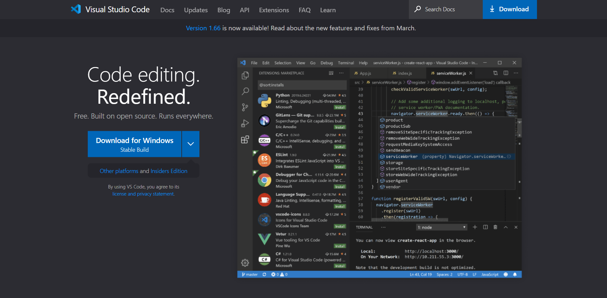

After Visual Studio Code finishes downloading, open it and it should something like this:

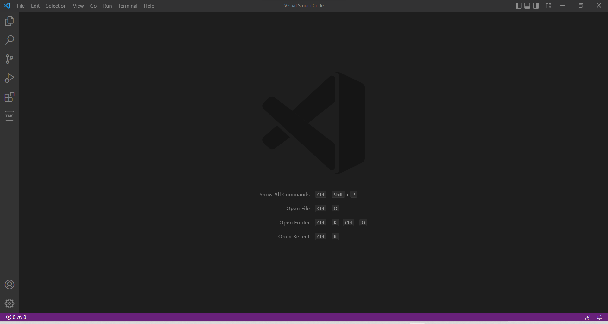

2. **Remotely Connecting**

First install OpenSSH Client and OpenSSH Server by opening Settings > Apps > Apps & features > Optional Features:

**(Opening Apps & Features may not be necessary since Optional Features can be selected outside Apps & Features, but inside the Apps section)**

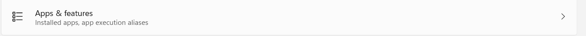

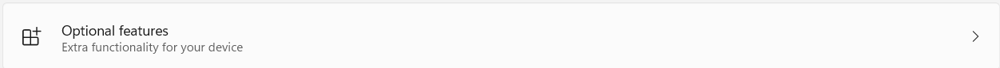

**(If OpenSSH Client and/or OpenSSH Server do not appear, this may mean that it has already been added)**

Look for your course-specific account in [https://sdacs.ucsd.edu/~icc/index.php](https://sdacs.ucsd.edu/~icc/index.php)

Your CSE 15L account should follow the format of cs15lsp22abc@ieng6.ucsd.edu where "abc" is different for everything account.

Open Visual Studio Code, and open the terminal. In the terminal, write the command ssh followed by your account. If it is the first time you are connecting remotely to a new server for the first, it will ask you to confirm if you want to continue. Select yes and type your account's password when prompted.

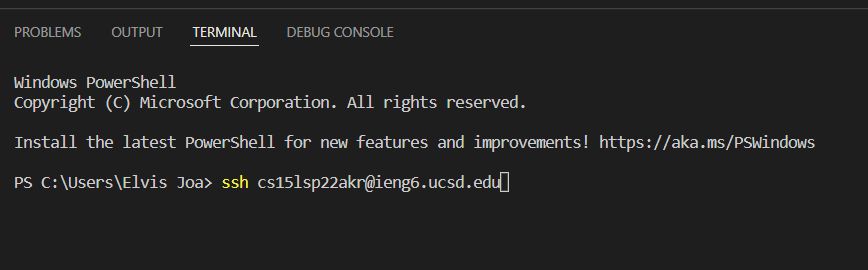

After this typing your password, the terminal should look something like this:

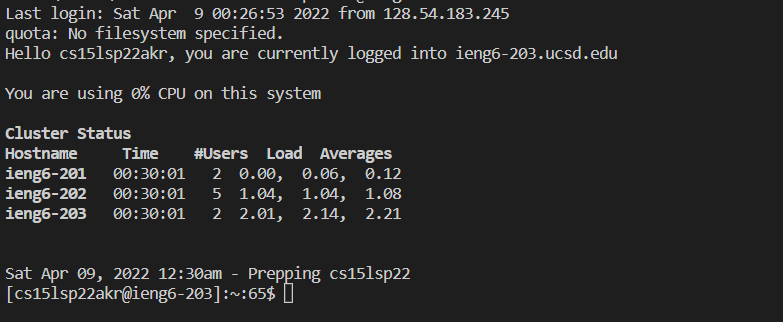

3. **Trying Some Commands**

Command lists:

* `ls` (used to show the files in the directory)
* `touch` (creates a file)
* `cat` (Prints the content of the file, if it does not exist, an error is printed)
* `echo` (Puts the string inside the file)
* `cp` (Makes a copy of a file with another name)

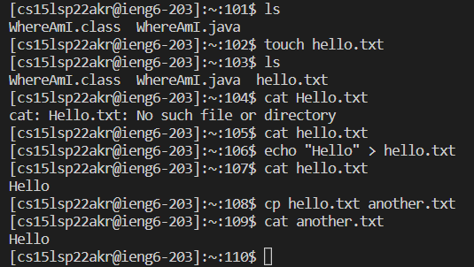

4. **Moving Files with scp**

The scp command will copy a file from the local client (your computer) and send it to the remote computers. The command will prompt you for the password before it runs successfully.

The format of the scp command is:

`scp` `Name of the file` `Your course-specific account:~/`

Before using scp command:

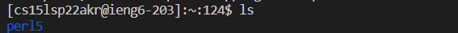

In client terminal:

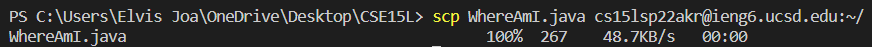:

After using scp command:

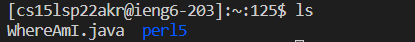

5. **Setting an SSH Key**

Using the `ssh-keygen` generates files that allows you to connect to the remote servers without being prompted to put a password every time.

After running `ssh-keygen` in the client terminal, you will be prompted to write where the key will be located in the client.

The format of what will appear after running `ssh-keygen` is:

(/Users/*User-name*/.ssh/id_rsa): /Users/*User-name*/.ssh/id_rsa or (C:\Users\*User-name*/.ssh/id_rsa): C:/Users/*User-name*/.ssh/id_rsa

where *User-name* will depend on the client computer.

Following this, you will prompted for a passphrase which is a different thing from the password used to connect to the remote computer.

After the key files are generated, use the following commands to copy the key files to the remote computer:

`ssh cs15lsp22zz@ieng6.ucsd.edu`

Enter the password to the remote computer

`mkdir .ssh`

`logout`

scp /Users/*User-name*/.ssh/id_rsa.pub cs15lsp22zz@ieng6.ucsd.edu:~/.ssh/authorized_keys

You should now be able to use `ssh` and `scp` without being prompted for your password.

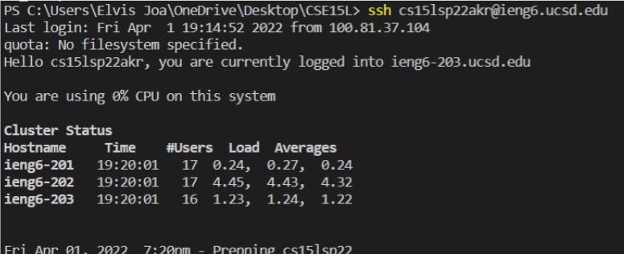

6. **Optimizing Remote Running**

There are many ways to make using the terminal and connecting the remote computer:

Multiple commands can be used by separating them with a semicolon (;):

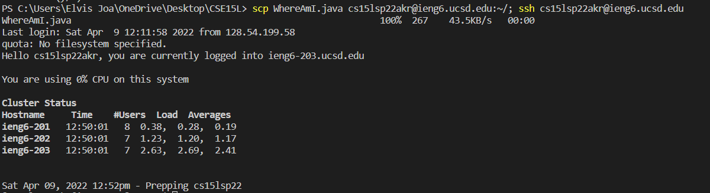

Following the `ssh` command, another command can be written to immediately run it without having to connect to the remote server and logout:

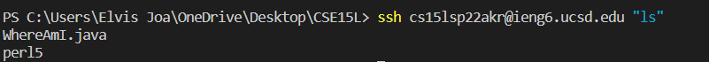

The up and down arrow can also be used in the terminal to scroll through the previous commands used, and not have to retype them all the time.
