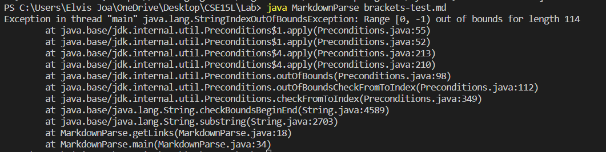
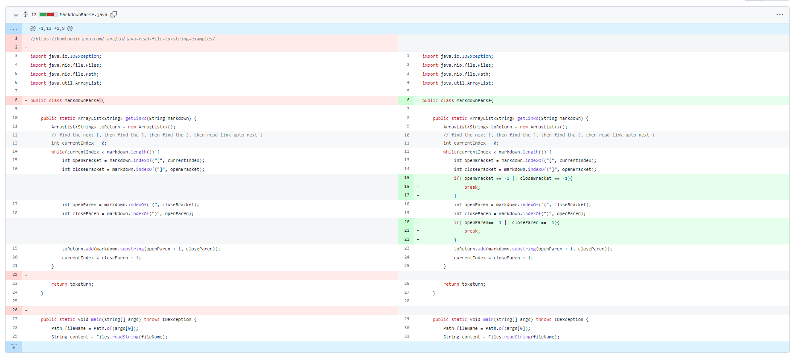
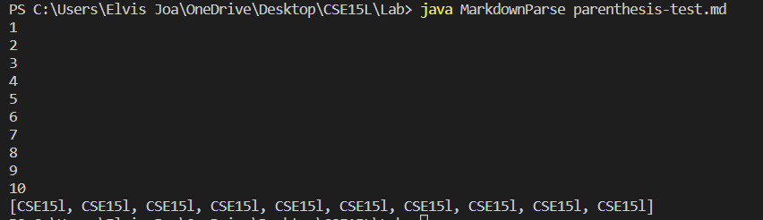
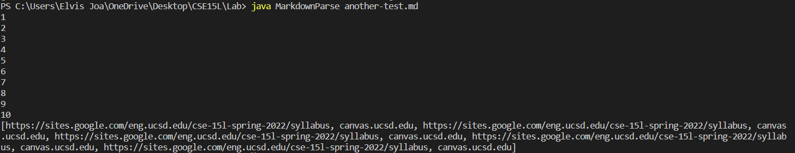

# Week 4 Lab Report

# [Failed Test 1](https://ejoa27.github.io/CSE15L/Test-files/brackets-test.md)

The bug in this code is that it does not have any countermeasures for when the test-file does not have the correct format. As shown in the image above, the symptom in the code is that there will be a StringIndexOutOfBoundsException when the code looks for a substring because it will start from the index of the first open parenthesis, in this case the starting index being -1 since the test-file does not have any parenthesis. I solved this bug by adding an if statement in lines 20-22 that checks if an open parenthesis or close parenthesis are not found after current index, the loop should, and the list of Strings should be returned. For this input, the list returned should be empty since none of the links in the test file have the correct format.

# [Failed Test 2](https://ejoa27.github.io/CSE15L/Test-files/parenthesis-test.md)

The bug in this code is that any test files with the incorrect format can lead to an infinite loop. The sympton in the code is that the code will always look for the first instance of an open parenthesis and take the substring from that index to the closest close parenthesis because when the code looks for an open parenthesis, it will look for it starting from the index of the close bracket which is -1 since there are no close brackets in the test file. In the image above, the code will continue forever, and not print anything so it can only be stopped by terminating the terminal. I added a counter that would break the loop once it went through 10 iterations for the purpose of testing what would be printed if the loop were to end. To fix this, I added an if statement from lines 15 to 17 which will break the loop if there are no brackets before the next instance of parenthesis since it would not follow the correct format. The method should have returned an empty list because none of the links in the test file followed the correct format.

# [Failed Test 3](https://ejoa27.github.io/CSE15L/Test-files/another-test.md)

The bug is that the code does not have anything that it can do when there is text other than links inside the file. The sympton caused by this bug is that the loop inside the getLinks method will repeat until the terminal is terminated because the currentIndex will always be less than the length of the test file since the currentIndex can only reach at a maximum, an int that is greater by a value of 1 than the index of the last close parenthesis in the test file. Similar to the previous bug, I added a counter that will break the loop once it reached 10 to see what the list returned would be if it were to end. Since the problem was that the value of closeBracket would be -1, and openParen and closeParen would then run successfully, changing the value of currentIndex again and again, I added an if statement in lines 15-17 that will end the loop if the value of the indexes of any of the brackets was -1. The output of the code should have been a list of 2 links since the last link in the test file did not follow the correct format.
