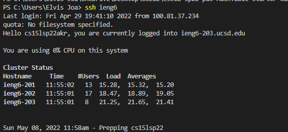

# CSE15L Lab Report 3
# [Link to index site](https://ejoa27.github.io/CSE15L/index.html)
# Streamlining ssh Configuration
Using an alias helps me use much shorter commands when using login into my account or using longer terminal commands that need me to write my user account multiple times.
I edited my config file by creating a config file in the .ssh folder of my user account folder, and adding the necessary lines to the config file. This allowed me to login into my ieng6 account without having to my complete username:

In this image, I login into my account using the alias instead of my whole user account:

In this image, I copy a file to my account using the alias instead of my whole user account:

# Setup Github Access from ieng6
Being able to access a Github repository through my ieng6 account makes it convenient to access my Github repository and work on it.
In Github, the public key is stored in the SSH and GPG keys section of the settings:

In my user account, the public key is located in a file called id_rsa.pub, and the private key is located in a file called id_rsa. Both are stored in the .ssh directory.

In the following images, I cloned a repository, and made a change to my previous lab report and commmited and pushed the file to change the one in my Github repository. [Link to commit](https://github.com/ejoa27/CSE15L/commit/abb7adbc51bcc462ef167420244cf83524275c3f)

# Copy whole directories with `scp -r`
Using one command to copy the files, login into my account, and run all the tests make it much easier to work with since I don't have to wait for the command to finish running, to write another command.
In this image, I copied the markdown-parse repository to my ieng6 account, logged into my account and ran the tests. All of these commands were done individually.

In this image, I did the same thing as before but I only used one command.

