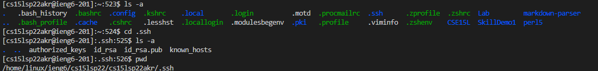

# CSE15L Lab Report 3
# Streamlining ssh Configuration
I edited my config file by creating a config file0 in the .ssh folder of my user account folder, and writing the necessary alias in the config file. This allowed me to login into my ieng6 account without having to my complete username:

# Setup Github Access from ieng6

# Copy whole directories with `scp -r`
