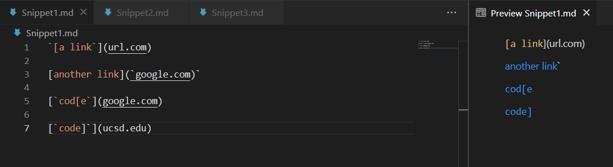
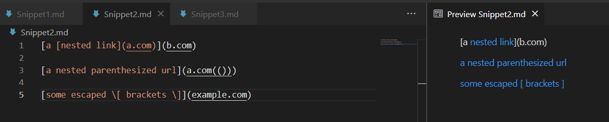
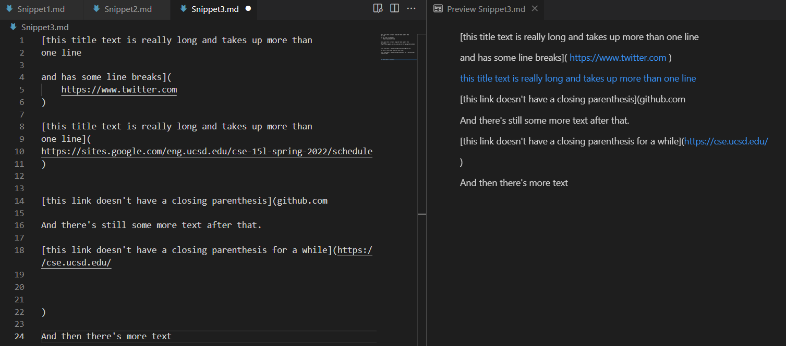
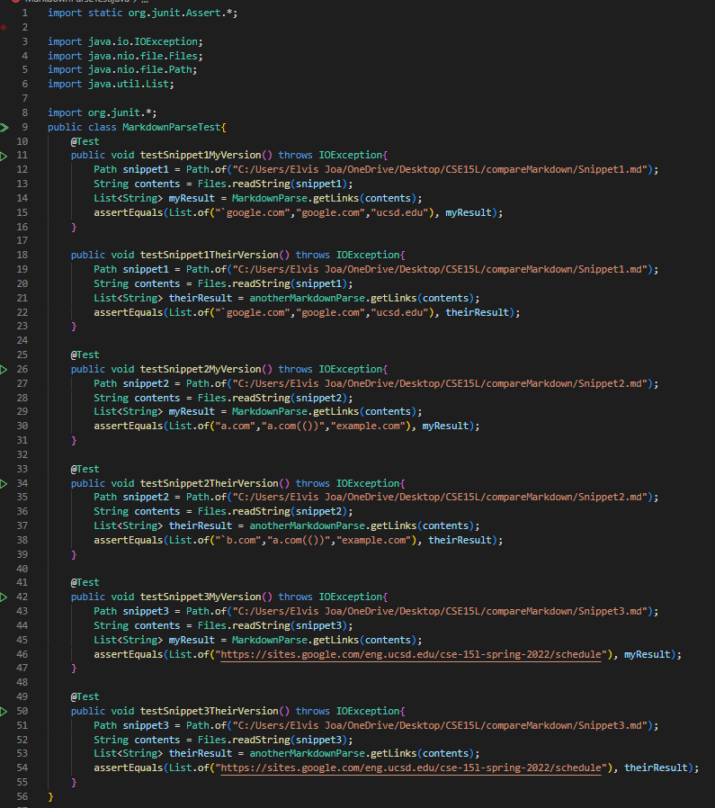
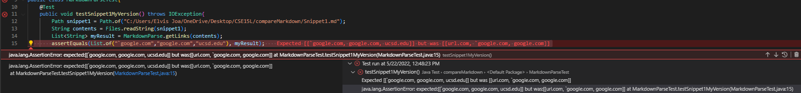
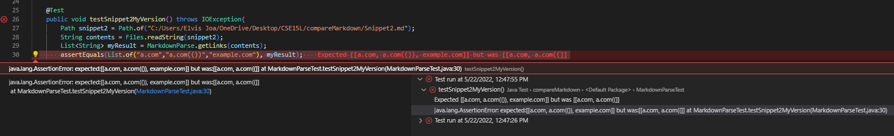
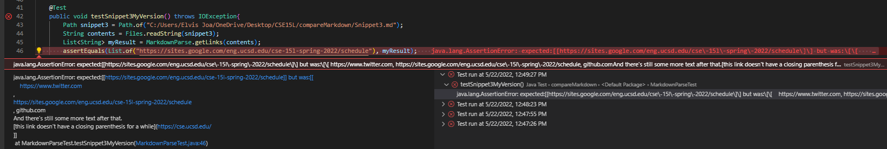
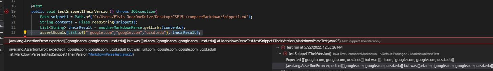
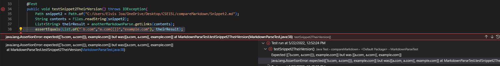
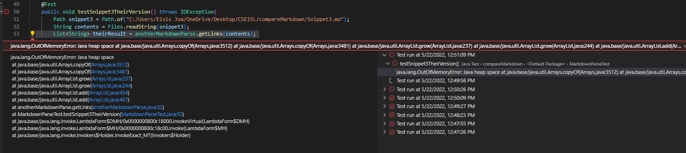

# Lab Report 3

# [Link to my markdown-parse repository](https://github.com/ejoa27/markdown-parser)

# [Link to the reviewed markdown-parse implementation](https://github.com/FishInAZ/makrdown-parse-own)

# What it should produce/Previews of the markdown files

## Snippet 1

## Snippet 2

## Snippet 3

# MarkdownParseTest.java file

# Tests for my implementation
## Snippet 1

## Snippet 2

## Snippet 3

# Tests for their implementation
## Snippet 1

## Snippet 2

## Snippet 3

# Question 1:

Do you think there is a small (<10 lines) code change that will make your program work for snippet 1 and all related cases that use inline code with backticks? If yes, describe the code change. If not, describe why it would be a more involved change.

I think that I could make my program work if I were to add a section that made that any text or code inside backticks be ignored and not counted towards brackets or parenthesis. My program worked for the second and third links but since the first one and fourth had a bracket inside the backticks, it counted the open bracket inside the backticks in the first one as the start of a link when it should have not, and in the fourth one, the first closing bracket character counted as the end of the text inside the bracket when it shouldn't have. I do think I could implement with a small code change, but it might take me about 15 lines.

# Question 2:
Do you think there is a small (<10 lines) code change that will make your program work for snippet 2 and all related cases that nest parentheses, brackets, and escaped brackets? If yes, describe the code change. If not, describe why it would be a more involved change.

I don't think I can fix my program to work by changing less than 10 lines of code beucase I think I would need to use add code that would find the correct closing parenthesis or bracket which I don't think I can make in under 10 lines of codes without also changing the current version of my program.

# Question 3:

Do you think there is a small (<10 lines) code change that will make your program work for snippet 3 and all related cases that have newlines in brackets and parentheses? If yes, describe the code change. If not, describe why it would be a more involved change.

I think I could make it that my program works for these cases by adding code that checks if the parenthesis opnes and closes in the same line, and checks for new lines. The problem with my program is that it will consider a closing parenthesis or bracket valid regardless of how many lines are in between so to fix this, I would need code that checks if they are in the same line.

# Conclusion

My program worked for some of the links for some of the Snippets test cases, but it did not work for any of the Snippets completely.
