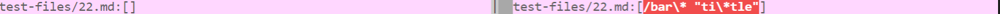
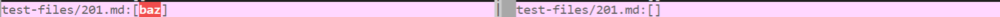
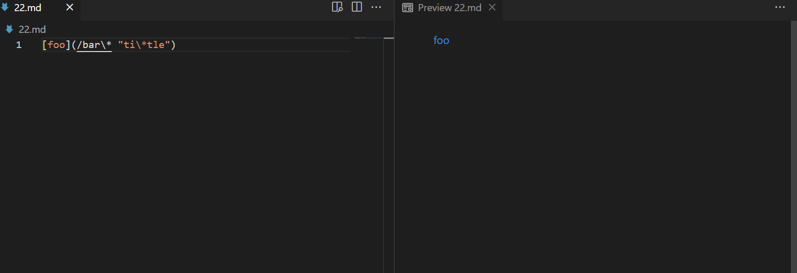
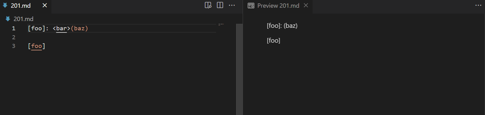
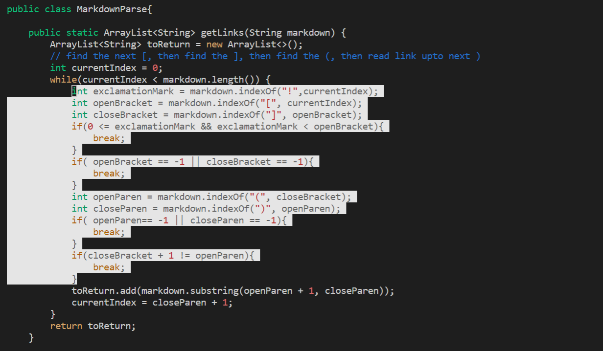
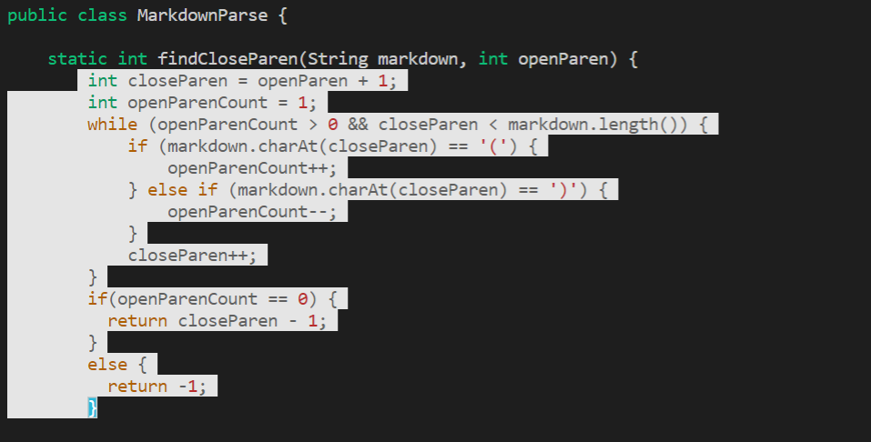

# Lab Report 5

**[Link to my markdown-parse repository](https://github.com/ejoa27/markdown-parser)**

# How did you find the tests with different results?

I found tests with different results using vimdiff after create two different results text file for the two different implementations of markdown-parse.

# Links to the test-file with different results

[22.md](https://github.com/nidhidhamnani/markdown-parser/blob/main/test-files/22.md)

[201.md](https://github.com/nidhidhamnani/markdown-parser/blob/main/test-files/201.md)

# Describe which implementation is correct, or neither if both give the wrong output
Indicate both actual outputs (provide screenshots) and also what the expected output is (list the links that are expected in the output).

The left side is Lab 9's implementation's output, and the right side is mine:

Test file 22.md:

Both of our outputs are not correct for test-file 22.md since the link leads to "bar*":

Test file 201.md:

For test-file 201.md, my output was correct since 201.md does not have any links:

Correct outputs:

Test file 22.md:

Test file 201.md:

Explanations:

Test file 22.md:

My implementation of markdown-parse does not do anything when it encounters a backslash or an asterisk, and considers it part of the link when it should have not. In ordero to fix this bug, I would have to make changes to the part of the code that looks for the link between parentheses.

Test file 201.md:

The implementation was wrong since it considers "baz" as a linke event though it is separated by ": <bar>" from the name of the link. The program should have not recognized that as a link, which can be fixed by changing the findCloseParen method to check if there is something between the bracket and parenthesis and to check if that should affect if a link is made. 
  

